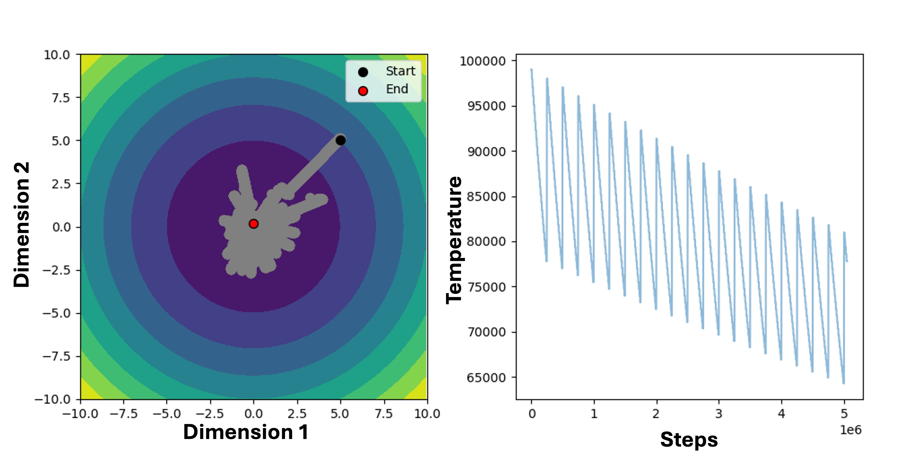

**SALaD: Efficient Optimization for Deep Learning**

SALD combines Simulated Annealing (SA) and Langevin Dynamics (LaD) to power robust global optimization of the non-convex objective functions common in deep learning. Inspired by techniques for minimizing complex physics potentials, this package delivers an effective tool for machine learning practitioners.

**Key Features**

* **Global Optimization:** Escapes local minima to find better solutions in complex loss landscapes.
* **Non-Convex Expertise:** Specifically designed to tackle the challenges of optimizing non-convex functions.
* **Efficiency:** The combination of LD and SA fosters rapid exploration of parameter spaces.
* **Deep Learning Focused:**  Tailored for optimizing  neural network models and training processes.

**Why SALD-Opt?**

* **Improved Model Performance:**  Discover parameter configurations that may outperform  standard optimization algorithms. 
* **Overcome Training Plateaus:** Break free from stagnant points during training, driving further progress.
* **Streamlined Implementation:** Provides a ready-to-use optimization solution for your deep learning workflows.

