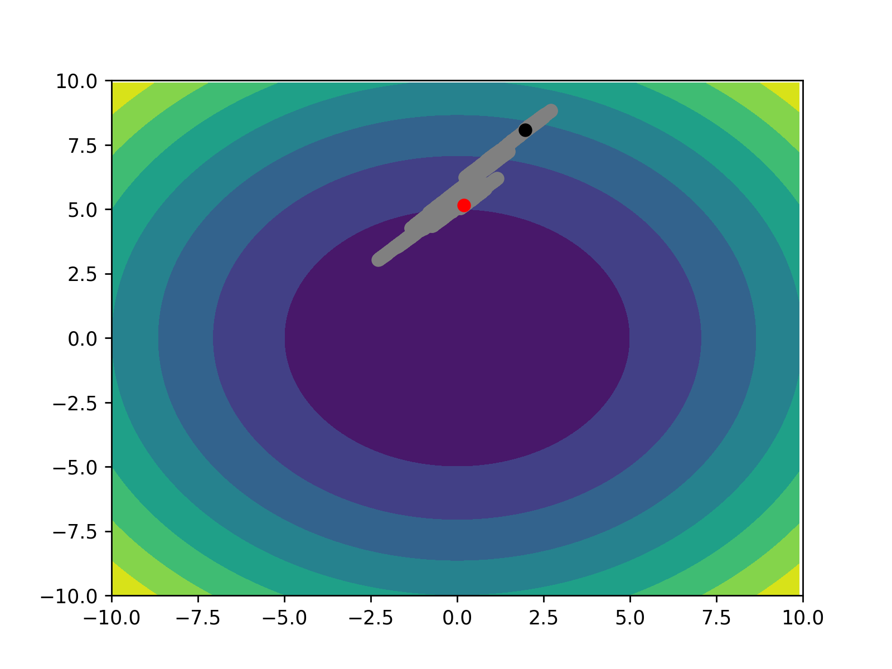

# SALD-Opt
Combined Langevin dynamics &amp; Simulated Annealing based optimization algorithm. 

Results of a optimization run on the rastrigin function: 

{x1}^{2}+x22−10(cos(2πx1)+cos(2πx2))

Temperature annel curve:

